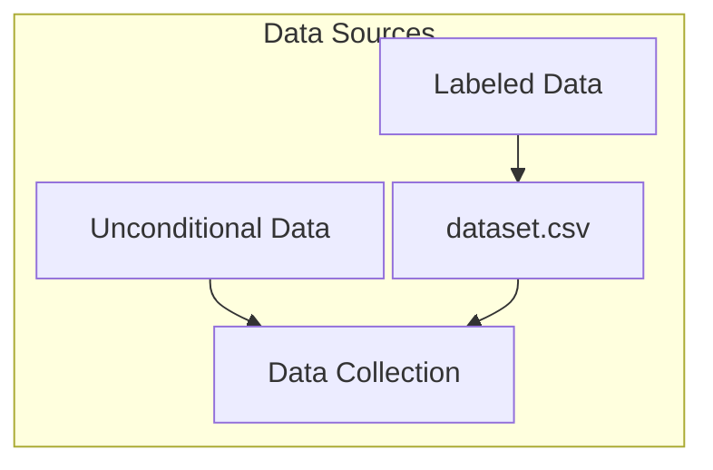
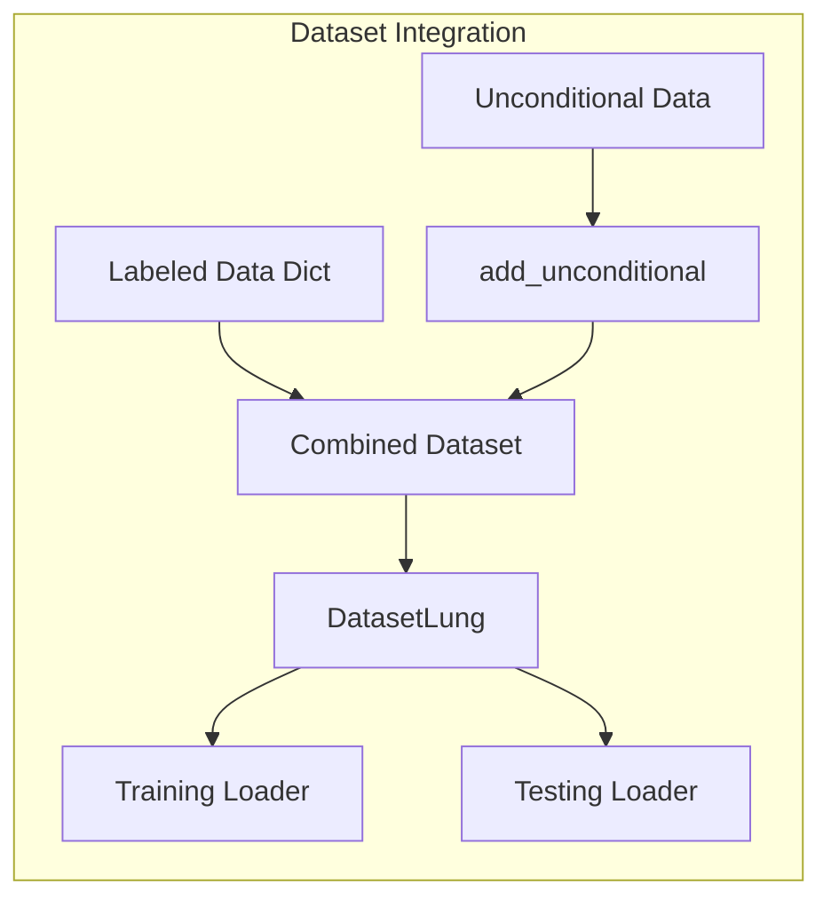

# Dataset Structure and Processing Flow

## Directory Structure
```bash
/path/to/labeled/dataset/
├── dataset.csv # Generated if missing (image file names and classes)
├── label_map_5.yml # Default label map file
├── label_map_10.yml # Another label map if your config needs 10 classes
├── image1.jpg
├── image1_mask.png
├── image2.jpg
├── image2_mask.png
└── ... (additional image/mask pairs)

/path/to/unconditional/dataset/
├── image1.jpg
├── image2.jpg
├── image3.jpg
└── ... (only .jpg files, no masks needed)
```

## Data Loading Configuration
```yaml
dm:
  data_folder: '../pathology-datasets/DRSK/full_dataset/labeled-data'      # Labeled data path
  extra_data_path: '../pathology-datasets/DRSK/full_dataset/unconditional-data'  # Unconditional data path
```

## Data Processing Flow

### 1. Data Preparation Flow


### 2. Labeled Data Processing
- Processes data_folder path containing image-mask pairs
- Generates dataset.csv containing:
  - Image filenames
  - Associated class labels from masks
- Supports class mapping via label_map_{n}.yml files
- Class 0 represents unconditional/background

### 3. Unconditional Data Integration
- Processes extra_data_path recursively
- Features:
  - No mask files required
  - Supports nested folder structure
  - All images automatically assigned to class 0
  - Two integration modes:
    - no_check=False: Only adds images not in labeled dataset
    - no_check=True: Adds all found images

### 4. Combined Dataset Creation


### 5. DatasetLung Class Behavior
- Sampling strategy:
  - Uses cutoff probabilities to balance class selection
  - cond_drop_prob controls ratio between conditional/unconditional samples
  - Unconditional samples (class 0) include:
    - All images from extra_data_path
    - No mask loaded, but zero mask auto added
- Image loading:
  - Labeled images: Loads both image and mask
  - Unconditional images: Loads image, creates zero mask
  - Searches both data_folder and extra_data_path
  - Progressive path resolution:
    1. Checks data_folder first
    2. If not found, searches through extra_data_path
    3. Supports nested directory structure in extra_data_path

### 6. Training Configuration Impact
- batch_size: Number of images per batch
- cond_drop_prob: Controls mixing of conditional/unconditional samples
- num_workers: Parallel loading threads
- transform: Augmentation pipeline applied to both sources