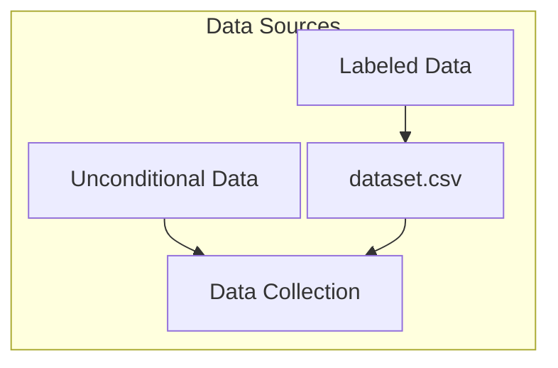
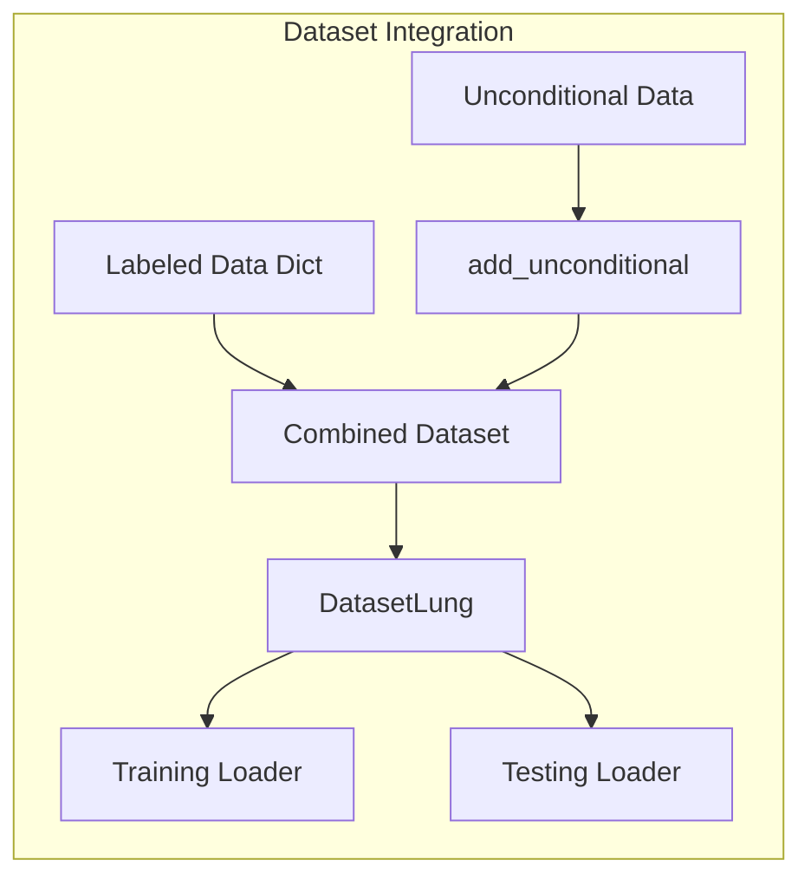

# Latent Diffusion Model Analysis & Dataset Structure
## Technical Deep Dive

---

# Overview
- Dataset Structure and Statistics
- Class Distribution Analysis
- Training Process Insights
- Model Architecture Details
- Label Mapping Strategies

---

# Dataset Statistics

- **Total Files**: 246,750 image files
- **Mask Files**: 246,755 (5 orphaned masks identified)
- **Zero-value Masks**: 156,024 files
- **Meaningful Masks**: 90,726 files



---

# Directory Structure
```bash
/path/to/labeled/dataset/
├── dataset.csv          # Image files and classes
├── label_map_5.yml     # 5-class mapping
├── label_map_10.yml    # 10-class mapping
├── image1.jpg
├── image1_mask.png
└── ...
```

---

# Dataset Split Distribution

- **Training Set** (~222,075 images)
  - Conditional: ~81,653 images
  - Unconditional: ~140,422 images

- **Testing Set** (~24,675 images)
  - Conditional: ~9,073 images
  - Unconditional: ~15,602 images

---

# 5-Class Distribution


```plaintext
Class 0 (Unknown): 74.01%
Class 1 (Background/Artifact): 4.29%
Class 2 (Inflammatory/Reactive): 5.62%
Class 3 (Carcinoma): 2.27%
Class 4 (Normal Tissue): 13.81%
```

---

# 10-Class Distribution

```plaintext
Class 0 (Unknown): 74.03%
Class 1 (Background): 3.37%
Class 2 (Artifacts): 0.92%
Class 3 (Carcinoma): 1.45%
Class 4 (Normal Dermis): 7.65%
Class 5 (Normal Epidermis): 0.60%
Class 6 (Normal Appendages): 5.56%
Class 7 (Inflammatory): 0.88%
Class 8 (Reactive): 4.73%
Class 9 (Structural): 0.80%
```

---

# Training Configuration

```yaml
model:
  image_size: 512
  dim: 256
  num_classes: 5
  dim_mults: [1, 2, 4]
  channels: 4
  resnet_block_groups: 2
  block_per_layer: 2

diffusion:
  timesteps: 1000
  sampling_timesteps: 250
  batch_size: 4
  lr: 0.0001
```

---

# Model Parameters

- Total Parameters: 172,101,124
- All parameters are trainable
- Uses OneCycleLR scheduler
- EMA model updated every 10 steps
- Debug mode enabled for detailed logging

---

# Class Embedding in UNet

```python
def p_losses(self, x_start, t, *, classes):
    # Input shape: [4, 4, 64, 64]
    # Timesteps: tensor([461, 266, 576, 891])
    # Mask size: [4, 1, 512, 512]
    # Class distribution: [4, 5]
    # Weighted embedding: [4, 256]
    # Classes embedding: [5, 256]
    # Conditional embedding: [4, 1024]
```

---

# Class Embedding Architecture in UNet

## Overview of Class Embedding Process

1. **Initial Mask Processing**:
```python
# Keep original masks for attention layers
masks = classes.clone()
```

2. **Class Distribution Calculation**:
```python
# Calculate per-image class distribution
class_dist = torch.zeros((batch, self.num_classes), device=device)
for c in range(self.num_classes):
    class_mask = (classes == c).float()
    class_dist[:, c] = class_mask.mean(dim=(1,2,3))
```

3. **Embedding Generation**:
```python
# Get embeddings using learned table
classes_emb = self.classes_emb(torch.arange(self.num_classes, device=device))  # [num_classes, dim]
# Weight embeddings by class distribution
weighted_emb = (classes_emb[None, :, :] * class_dist[:, :, None]).sum(1)  # [batch, dim]
```

## Key Technical Details

- Input Shape: [batch_size, channels, height, width]
- Mask Shape: [batch_size, 1, height, width]
- Class Distribution: [batch_size, num_classes]
- Embedding Dimension: [num_classes, embedding_dim]
- Final Embedding: [batch_size, embedding_dim]

## Features

1. **Proportional Representation**:
   - Captures class proportions in each mask
   - Handles multiple classes per mask
   - Preserves spatial distribution information

2. **Learnable Components**:
   - Embedding table trained with model
   - MLP for further embedding processing
   - Attention mechanism utilization

3. **Implementation Benefits**:
   - Memory efficient
   - Handles variable class presence
   - Smooth gradient flow
   - Stable training behavior

---

# Data Processing Flow



---

# Class Mapping Strategy

5-Class System:
1. Unknown (74.01%)
2. Background/Artifact (4.29%)
3. Inflammatory/Reactive (5.62%)
4. Carcinoma (2.27%)
5. Normal Tissue (13.81%)

Rationale: Balance between clinical relevance and statistical representation

---

# Dataset Loading Behavior

```python
class DatasetLung(Dataset):
    def _cutoffs(self):
        # Training cutoff probs: [0.5, 0.625, 0.75, 0.875, 1.0]
        # Test cutoff probs: [0.0, 0.25, 0.5, 0.75, 1.0]
        individual_probs = [(1 - conditional_drop_prob) / (num_classes - 1)] * num_classes
        individual_probs[0] = conditional_drop_prob
        return np.cumsum(individual_probs)
```

---

# Image Processing Pipeline

1. Load image and mask
2. Normalize to [0, 1] range
3. Apply data augmentation
4. Move to GPU (cuda:0)
5. Process mask classes
6. Generate conditional embeddings

---

# Model Architecture Details

- UNet backbone
- Conditional class embeddings
- Timestep embeddings
- EMA model for stability
- Gaussian diffusion process
- Custom loss function for noise prediction

---

# Performance Metrics

Initial training shows:
- High variance in loss values
- Stable GPU memory usage
- Effective batch processing
- Consistent gradient updates
- Regular model checkpointing

---

# Technical Observations

1. Class imbalance impact on training
2. Memory efficient data loading
3. Stable diffusion process
4. Effective class embedding
5. Robust data augmentation

---

# Questions?

Thank you for your attention!

Contact: [Your Contact Information]
