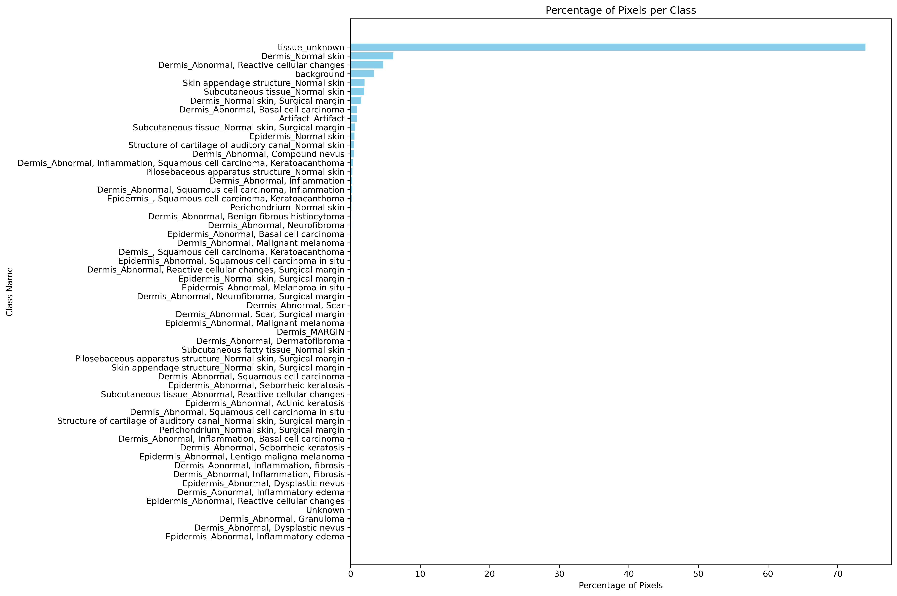

# Class Distribution Analysis



## Original Class Distribution Overview

The original dataset shows significant class imbalance with:
- Dominant class: tissue_unknown (74.01%)
- Major normal tissue classes:
  * Dermis_Normal skin (6.13%)
  * Skin appendage structure_Normal skin (2.00%)
  * Subcutaneous tissue_Normal skin (1.96%)
- Significant pathological classes:
  * Dermis_Abnormal, Reactive cellular changes (4.68%)
  * Background (3.37%)
  * Artifact_Artifact (0.92%)
- Many rare classes (<0.1% each):
  * Various types of inflammation
  * Specific carcinomas
  * Specialized structures
- Ultra-rare classes (<0.001%):
  * Multiple "Unknown" categories (labels 55-73)

This distribution presents challenges for model training, necessitating strategic class grouping to create more balanced categories while maintaining clinical relevance.

# Class Groupings

This document describes how the original classes are grouped into reduced class sets for different classification scenarios.

## 5-Class Grouping
```bash
5-Class Distribution:
------------------------------
Class 0 (Unknown): 74.01%
Class 1 (Background/Artifact): 4.29%
Class 2 (Inflammatory/Reactive): 5.62%
Class 3 (Carcinoma): 2.27%
Class 4 (Normal Tissue): 13.81%
```
### Distribution and Detailed Mapping
1. **Unknown (Class 0) - 74.01%**
   - Original tissue_unknown

2. **Background/Artifact (Class 1) - 4.29%**
   - Original background
   - Artifact_Artifact

3. **Inflammatory/Reactive (Class 2) - 5.62%**
   - Dermis_Abnormal, Inflammation
   - Dermis_Abnormal, Inflammation with BCC/Fibrosis/SCC
   - Epidermis_Abnormal, Inflammatory edema
   - Dermis_Abnormal, Reactive cellular changes
   - Subcutaneous tissue_Abnormal, Reactive

4. **Carcinoma (Class 3) - 2.27%**
   - Dermis/Epidermis_SCC variants
   - Basal cell carcinoma
   - Benign fibrous histiocytoma
   - Compound/Dysplastic nevus
   - Dermatofibroma
   - Granuloma
   - Malignant melanoma variants
   - Neurofibroma
   - Scar tissue
   - Seborrheic keratosis
   - Actinic keratosis

5. **Normal Tissue (Class 4) - 13.81%**
   - Normal Dermis
   - Normal Epidermis
   - Normal Perichondrium
   - Normal Pilosebaceous apparatus
   - Normal Skin appendages
   - Normal Structure of cartilage
   - Normal Subcutaneous tissue
   - All corresponding surgical margin variants

## 10-Class Grouping

```bash
10-Class Distribution:
------------------------------
Class 0 (Unknown): 74.03%
Class 1 (Background): 3.37%
Class 2 (Artifacts): 0.92%
Class 3 (Carcinoma): 1.45%
Class 4 (Normal Dermis): 7.65%
Class 5 (Normal Epidermis): 0.60%
Class 6 (Normal Appendages): 5.56%
Class 7 (Inflammatory): 0.88%
Class 8 (Reactive): 4.73%
Class 9 (Structural): 0.80%
```

### Distribution and Detailed Mapping
1. **Unknown (Class 0) - 74.03%**
   - Original tissue_unknown
   - Various unclassified abnormal conditions

2. **Background (Class 1) - 3.37%**
   - Original background regions

3. **Artifacts (Class 2) - 0.92%**
   - Artifact_Artifact

4. **Carcinoma (Class 3) - 1.45%**
   - All SCC variants
   - All BCC variants
   - Malignant melanoma variants
   - Actinic keratosis

5. **Normal Dermis (Class 4) - 7.65%**
   - Dermis_Normal skin
   - Dermis_Normal skin, Surgical margin

6. **Normal Epidermis (Class 5) - 0.60%**
   - Epidermis_Normal skin
   - Epidermis_Normal skin, Surgical margin

7. **Normal Appendages (Class 6) - 5.56%**
   - Normal Perichondrium
   - Normal Pilosebaceous apparatus
   - Normal Skin appendages
   - Normal Structure of cartilage
   - Normal Subcutaneous tissue
   - All corresponding surgical margin variants

8. **Inflammatory (Class 7) - 0.88%**
   - Pure inflammatory conditions
   - Inflammatory edema
   - Inflammation with BCC/SCC

9. **Reactive (Class 8) - 4.73%**
   - Reactive cellular changes
   - Subcutaneous reactive changes

10. **Structural (Class 9) - 0.80%**
    - Benign fibrous histiocytoma
    - Compound/Dysplastic nevus
    - Dermatofibroma
    - Granuloma
    - Neurofibroma
    - Scar tissue
    - Seborrheic keratosis

# Class Groupings Rationale

## 5-Class System Rationale

The 5-class grouping system balances clinical relevance with class distribution:

1. **Unknown (74.01%)**
   - Kept separate due to its dominant presence
   - Cannot be reliably merged with other classes due to uncertainty
   - Serves as background/negative class

2. **Background/Artifact (4.29%)**
   - Combined background (3.37%) and artifacts (0.92%)
   - Merged due to similar semantic meaning (non-tissue elements)
   - Creates more balanced representation of non-tissue elements

3. **Inflammatory/Reactive (5.62%)**
   - Combines inflammatory conditions (0.88%) with reactive changes (4.73%)
   - Both represent tissue response to injury/stimuli
   - Merging creates more substantial training representation
   - Similar pathological mechanisms and appearance

4. **Carcinoma (2.27%)**
   - Groups all malignant and pre-malignant conditions
   - Combines small but clinically crucial classes
   - Includes related structural changes
   - Ensures sufficient representation for critical diagnostic features

5. **Normal Tissue (13.81%)**
   - Combines all normal tissue types for better representation
   - Second largest class provides strong baseline
   - Includes surgical margins as they represent normal tissue
   - Balances clinical need with statistical representation

## 10-Class System Rationale

The 10-class system provides finer granularity while maintaining reasonable class sizes:

1. **Unknown (74.03%)**
   - Maintained as largest class
   - Essential for model's uncertainty handling

2. **Background (3.37%)** & **Artifacts (0.92%)**
   - Separated to distinguish processing artifacts from true background
   - Important for quality control
   - Combined represent 4.29% of pixels

3. **Carcinoma (1.45%)**
   - Pure malignant conditions
   - Critical for diagnostic accuracy
   - More focused than 5-class version

4. **Normal Dermis (7.65%)** & **Normal Epidermis (0.60%)**
   - Separated despite size difference
   - Clinically distinct tissues
   - Key for anatomical understanding

5. **Normal Appendages (5.56%)**
   - Combines smaller normal structures
   - Creates meaningful intermediate-sized class
   - Anatomically coherent grouping

6. **Inflammatory (0.88%)** & **Reactive (4.73%)**
   - Separated to distinguish acute from chronic changes
   - Reactive class large enough to stand alone
   - Important for disease progression understanding

7. **Structural (0.80%)**
   - New category for non-inflammatory changes
   - Groups related but rare conditions
   - Maintains clinical relevance despite small size

### Key Distribution Considerations
- Unknown class maintained as majority class in both systems
- 5-class system ensures no non-unknown class falls below 2%
- 10-class system accepts smaller classes (minimum 0.60%) for clinical relevance
- Surgical margin variants consistently grouped with their parent tissue types
- Balance between statistical representation and clinical meaning

