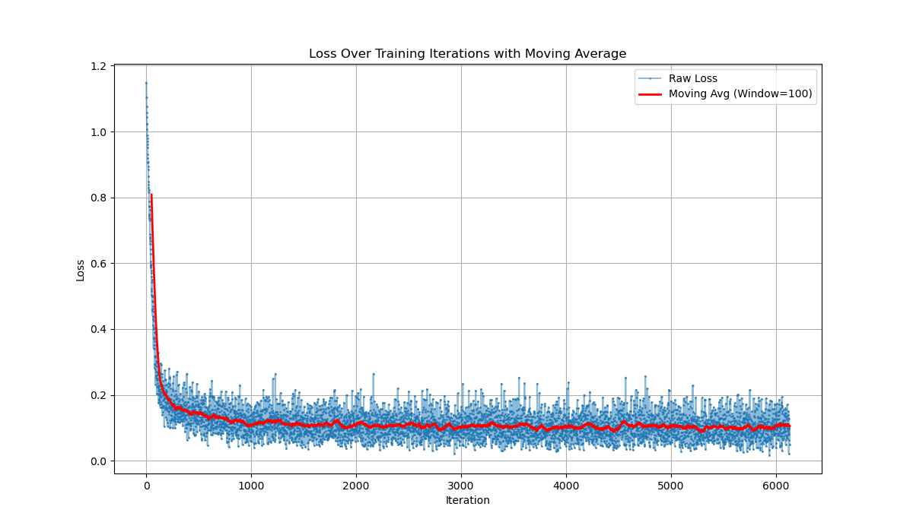
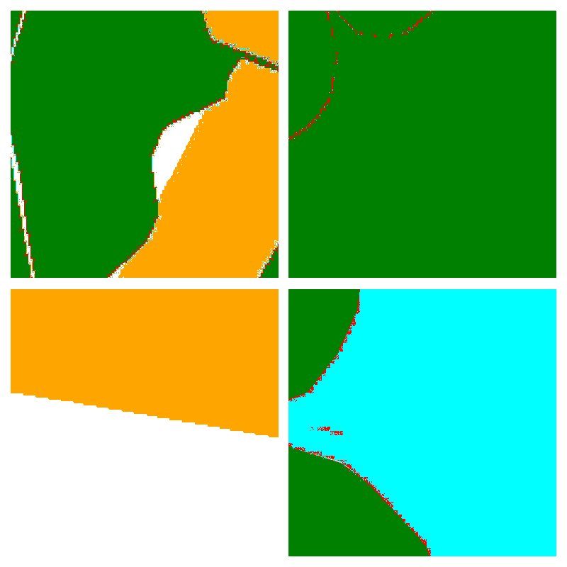

# Training Report - DrSk 512x256 5-class Model

## Training Configuration

- Image Resolution: 512x512
- Base Dimensions: 256
- Number of Classes: 5
- Batch Size: 64
- Learning Rate: 0.0001
- Training Steps: 100,000
- Sampling Timesteps: 250/1000
- Gradient Accumulation: 2
- Latent Normalizing Scale: 1/50
- Model Architecture:
  - Channels: 4
  - Dimension Multipliers: [1, 2, 4]
  - ResNet Block Groups: 2
  - Blocks per Layer: 2

## Loss Analysis

The loss curve shows steady convergence over training steps, with notable observations:
- Initial rapid descent in the first 1000 steps
- Stabilization period between steps 1000-2500
- Gradual refinement after step 2500

## Sample Generation Progress

### Step 1000

    
    
    

### Step 2500

    
    
    

### Step 5000 

    
    
    

